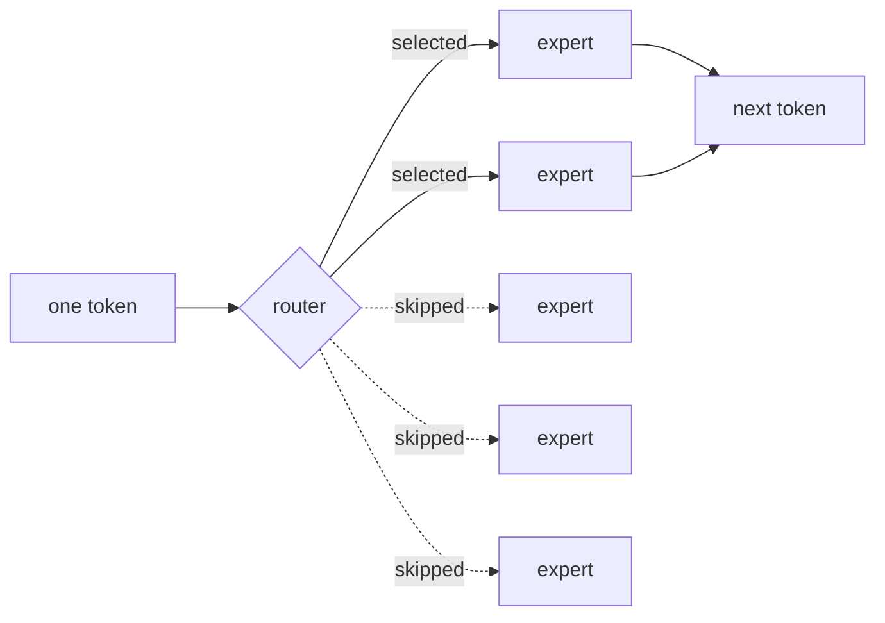
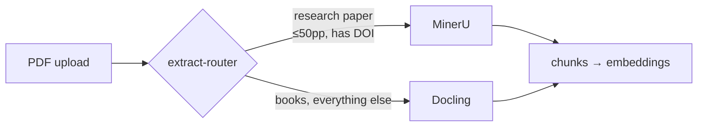

I wanted to know what actually happens when you type into a chat box.

Not the metaphor — the machine. Which bytes move, what's slow, why a model that
fits on a hard drive somehow can't run on the computer it's sitting on. The only
way I know to learn that is to build the thing badly a few times, so I bought a
small box and started taking it apart.

There's now a 122B-parameter model under my desk answering questions about the
books I'm reading, and nothing I ask it leaves the house. Here's how it got
there, including the parts that are still broken.

I called it **Outis Mneme** — "nobody's memory." Odysseus tells the Cyclops his
name is Nobody, and escapes because of it. On this machine, what you read, ask,
and think about is equally unattributable. That felt like the right name for a
box whose whole point is that it doesn't phone anyone.

The hardware is an [ASUS Ascent GX10](https://www.amazon.ca/dp/B0GSZQTSJZ):
[NVIDIA GB10](https://www.nvidia.com/en-us/products/workstations/dgx-spark/),
128GB of unified LPDDR5x. Unified, meaning the CPU and the GPU
share one pool of memory instead of each keeping its own. I didn't think much of
that when I bought the box. It ended up behind almost every decision I made
afterwards.

## Fork one: don't use Ollama

Everyone starts with [Ollama](https://github.com/ollama/ollama). I nearly did,
then read
[Stop Using Ollama](https://sleepingrobots.com/dreams/stop-using-ollama/), which
lays out how Ollama wrapped Georgi Gerganov's llama.cpp, spent a year not
mentioning it in the README, and later forked to a custom backend that
reintroduced bugs llama.cpp had already fixed. The benchmarks in there aren't
flattering either.

So I went straight to [llama.cpp](https://github.com/ggml-org/llama.cpp). It
also happened to suit what I was actually there for: llama.cpp makes you say
what you want. Every flag is a decision you have to understand first. That's
friction if you want a chatbot by dinnertime, and exactly right if you're trying
to learn the machine.

## Fork two: a model good enough to show me what wasn't

I started on **[Qwen3.6-27B](https://huggingface.co/Qwen/Qwen3.6-27B) at Q8_0**,
after reading
[Qwen 3.6 is awesome](https://quesma.com/blog/qwen-36-is-awesome/) — the author
calls it the first local model that makes sense as a general intelligence, and
for chat and summarizing, they're right. It was genuinely good.

Then I started asking it to reason. Work through a problem, hold several
constraints at once, notice when its own earlier step was wrong. A 27B doesn't
fail loudly at that. It fails *confidently*, which is worse, because you have to
already know the answer to catch it.

So I went looking for something bigger, and immediately hit the obvious wall: a
122B model is about 90GB of weights. How could that possibly run on a desktop?

## The one number that explains everything

This is the thing I came here to learn, and it turned out to be simpler than I
expected.

To produce one word, the machine reads the model out of memory. Not think about
it — read it. Which means the thing setting the speed limit isn't how fast the
GPU can do maths. It's how fast memory can hand the bytes over. So the speed is
a division:

```
words per second  =  bytes memory can move in a second
                     ────────────────────────────────
                       bytes one word costs to read
```

The GX10 moves about 276 GB every second. (ASUS doesn't publish that number on
their own spec page, oddly — it comes from
[ServeTheHome's coverage](https://www.servethehome.com/this-is-the-asus-ascent-gx10-a-nvidia-gb10-mini-pc-with-128gb-of-memory-and-200gbe/).)

An ordinary 122B model is about 90GB on disk, and it reads all 90 of them for
every single word. So:

```
276 ÷ 90  ≈  3 words per second
```

Three words a second is a machine you stop opening.

What saves it is a different kind of model, called Mixture-of-Experts. The one I
run is [Qwen3.5-**122B-A10B**](https://huggingface.co/Qwen/Qwen3.5-122B-A10B),
and that `A10B` in the name is the whole trick. The model is 122B in total, but
it's split into chunks, and each word only goes through about 10B worth of them.
The rest sits in memory untouched for that word. All of it still has to fit in
the box — but only the small part in use has to be read.



So it reads about 7.25GB per word instead of 90. Same division:

```
276 ÷ 7.25  ≈  38 words per second
```

Three, or thirty-eight. Same box, same amount of memory filled, same size of
model on disk. The only thing that changed is how much of it gets read each
time. So picking a model was never really a question about how clever the model
is. It was a question about how much of it my machine has to read.

## Then I actually measured it

I'd been repeating that division to myself for months without once checking it
against the box in front of me. So I finally did. Six runs, six different
prompts so nothing came back from a cache.

```
generation  n=6  mean 26.97  stdev 0.02  min 26.93  max 27.00 tok/s
```

The paper version said 38 a second. The box does 27. That's about 70% of what
the spec sheet promises, and I was happy to see it — memory never quite runs at
its rated speed once it's in a real machine, and 70-ish percent is roughly what
normal looks like. A division I did on paper predicted a machine sitting on my
desk. That still feels like a good day.

The part I didn't expect was how little the number moved. Across six runs it
went from 26.93 to 27.00 and that's it. Usually when you measure something twice
you get two answers. Here nothing else is competing for the machine — it's
reading memory, and only reading memory, at the same rate every time.

(Versions, because this kind of claim rots fast: llama.cpp build
`b10326-3653e6d6d`, Q5_K_M, 256K context, `--parallel 1`.)

## One number I got badly wrong

My first attempt at measuring prompt processing gave 73 tok/s and I nearly wrote
it down as fact. It's off by more than a factor of ten — the real figure is
800-plus.

The mistake is worth keeping. I measured on 20-token prompts, where the fixed
cost of setting up a request completely swamps the actual work, so I was
carefully timing overhead. The server's own logs, grinding through a
21,846-token prompt, told the truth at ~620 tok/s sustained.

The gap between those two numbers is the useful part. Reading your question and
writing the answer are two different jobs. Reading can be done in bulk — the
machine can chew through thousands of words of your question at once, so it's
fast. Writing can't, because each word it writes depends on the word before it,
so it goes one at a time and waits on memory each time. Same server, two very
different speeds, and a 20-word prompt is too small to show you either.

## What a long conversation costs

That mistake made me suspicious of something else I'd written in my own README
with nothing behind it: that shrinking the conversation memory is "what makes a
256K context fit."

Here's what that claim is about. While you talk to the model, it keeps a running
record of the conversation so it doesn't have to re-read your words from scratch
every time. That record has a name — the KV cache — and it lives in the same
memory as the model. Every new word the model writes, it reads that whole record
again. So a long conversation isn't just longer. It's slower, for the same
reason the model itself is slow: more bytes to get through.

I measured it at four conversation lengths:

| Words of conversation so far | Speed | vs a fresh chat |
|---|---|---|
| 22 | 27.68 tok/s | — |
| 4,025 | 27.09 tok/s | −2.1% |
| 15,915 | 25.44 tok/s | −8.1% |
| 31,929 | 23.30 tok/s | −15.8% |

The slowdown is a clean straight line (R² 0.999), which makes it easy to project
forwards. Each word of conversation adds about **42 KB** that gets re-read for
every word the model writes. Carry that out to a full 256K conversation and the
record alone needs:

- **11 GB**, stored the compact way
- **22 GB**, stored the way it comes by default

The box has 128GB and the model is already sitting in 90 of them. So that 11GB
difference is the whole story: one version leaves room for a long conversation,
the other doesn't. The README was right. It just hadn't earned it until there
was a number under it.

## What all of this was actually for

I didn't build this to benchmark it. I have a large collection of ebooks, and I
wanted to ask questions across them and get citations I could check — to learn
faster from things I'm already reading, and to be able to verify the machine's
work rather than trust it.

[Open WebUI](https://github.com/open-webui/open-webui) fit almost perfectly:
chat, document knowledge bases, tool calling, all pointed at an
OpenAI-compatible endpoint, which llama.cpp already speaks.

Then the interesting failures started.

**The default embedder was wrong for books.** Open WebUI ships with
[`all-MiniLM-L6-v2`](https://huggingface.co/sentence-transformers/all-MiniLM-L6-v2),
which is fine for chat-sized snippets and hopeless for
typeset pages — its context window chops a page into fragments mid-thought. I
swapped it for
**[nomic-embed-text-v1.5](https://huggingface.co/nomic-ai/nomic-embed-text-v1.5)**
at Q8_0, running as its own llama.cpp process with an 8192-token window, so a
long page survives as a single chunk.

It runs as a separate service deliberately. Embedding happens constantly — every
upload, every query — while generations are long and serial. Share one process
and your embedding jobs queue up behind somebody's 2,000-token answer.

**Then PDF extraction ate weeks.** Open WebUI's built-in extractor is
[pypdf](https://github.com/py-pdf/pypdf),
which inserts spurious spaces into typeset books: "an e xample", "the ne xt
step." I assumed that was cosmetic. It isn't — `e xample` embeds as a completely
different vector than `example`, so every mangled word quietly poisons
retrieval. The text looked *almost* fine, which is why it took me so long to
suspect it.

I went through [Tika](https://tika.apache.org/), then
[Docling](https://github.com/docling-project/docling), then
[MinerU](https://github.com/opendatalab/MinerU). Open WebUI only lets you
configure **one** extractor, so I ended up writing a small router to take that
slot and dispatch per document:



The payoff was measurable. One collection went from 68,193 chunks under pypdf to
47,296 under a real extractor — **28% of it had been garbage**, spurious spaces
inflating the character count. Fewer, cleaner chunks means less storage and less
junk competing for the handful of retrieval slots that actually reach the model.

## And it still doesn't work

Here's the honest ending. After three extractors, a custom router and a better
embedding model, **the citations still aren't good enough.**

The model reliably finds the right book. What it can't tell me is *where*. The
citation resolves to a chunk, not to a page or section I can turn to and check.
That makes it decorative — it looks verifiable and isn't, which is arguably
worse than no citation at all, because it invites exactly the trust it hasn't
earned. The entire point was checkable sources, and that's the part still
missing.

My current suspicion is that page anchors have to survive extraction *and* be
carried through chunking as metadata, and that none of the three extractors
preserve them in a form Open WebUI holds onto.

But I've parked it. Not solved — parked, deliberately. I could keep grinding on
extraction, and the honest assessment is that the next increment of effort there
buys me less than almost anything else I could do with the same hours. The
retrieval works well enough to point me at the right book, and I can find the
page myself. Knowing when a problem is genuinely blocking versus merely
unfinished is a skill I'm still bad at, and this was me trying to practise it.
It'll be there when it's worth doing.

There's a second loose thread I only noticed while writing this up. The 122B
GGUF ships multi-token-prediction weights, and llama.cpp is discarding them at
startup:

```
W model has unused tensor blk.48.nextn.eh_proj.weight (size = 20054016 bytes) -- ignoring
```

`nextn` is MTP — the same feature the Qwen 3.6 post measured at a **78%**
speedup on their hardware. So there may be a significant amount of performance
sitting unused inside a file I've been running for months. I don't yet know
whether this build can enable it for this architecture. If you do, I'd like to
hear it.

## Out of room, which is the good news

The thing I keep coming back to is that I've nearly filled the box. Peak memory
sits around 120GB of 128, and the GPU tops out near 96%. Right now, idle, the
host reports 107GB in use with 14 free.

Which is the same sum from the top of this post, coming at me from the other
side. 90GB of model, plus the 11GB of conversation record at full length, is
101GB before the embedding model, the extractors and the UI have asked for
anything. The same division told me how fast this machine would be and where it
would run out of room. I didn't expect that when I started — that one number
would end up describing both walls.

(A small aside I enjoyed: `nvidia-smi` reports `[N/A]` for GPU memory on this
box. With unified memory there is no separate GPU pool to report. The tool has
nothing to tell you because the question doesn't apply.)

So there's a long way to go, and that's the fun part. Two things I'm heading for
next:

**[Qwen3.8-27B](https://huggingface.co/Qwen/Qwen3.8-27B)**, which landed under
Apache 2.0 in mid-August — a 27B with vision built in and a 262K context. Doing
the same division on it gave me a result I found genuinely funny. It's an
ordinary model, so it reads all of itself every word:

| Model | Bytes read per word | Speed |
|---|---|---|
| Qwen3.8-27B, Q5_K_M | 19.6 GB | ~10 tok/s (predicted) |
| Qwen3.5-122B-A10B, Q5_K_M | 7.25 GB | **26.97 tok/s (measured)** |

So the 122B should run about **2.7× faster than the 27B**. The bigger model,
four and a half times the size, going nearly three times quicker, on the same
box. Which is the point of this whole post in one row: on a machine like this,
how big a model is tells you almost nothing about how fast it'll be. How much of
it gets read tells you everything. I'll run it and find out if I'm right.

**[DeepSeek Harness](https://github.com/deepseek-ai/deepseek-harness)**, an
agent framework built entirely around plugins — "everything is a plugin." It's
in developer preview, so I expect sharp edges, but the architecture is the right
shape for where I actually want to end up.

**A [Prometheus](https://prometheus.io/docs/introduction/overview/) and
[Grafana](https://grafana.com/docs/grafana/latest/) stack**, so I can stop doing
this by hand. Every
number in this post came from me curling an endpoint, grepping a log, or fitting
a line in a throwaway script. That's fine for answering one question once. It's
useless for the thing I actually want, which is noticing that generation got
slower last Tuesday and knowing why. Tokens per second against context depth,
KV cache occupancy, queue time, memory headroom — the same quantities I've been
measuring, but continuously and while I'm not looking.

The starting point turns out to be one flag. llama.cpp already has the endpoint;
it's just switched off:

```bash
$ curl -o /dev/null -w '%{http_code}\n' http://localhost:8080/metrics
501
```

A 501 rather than a 404 is the tell — the route exists, the server is telling me
it isn't implemented *as configured*. Adding `--metrics` turns it on. Tuning
inference by intuition is what I've been doing for months, and I'd like to
graduate to tuning it by evidence.

Because the goal was never a chatbot, and it was never really a benchmark
either. I want maximum automation of my own workloads, run on hardware I
control. And more than that: I read constantly, and
I want this thing to make me learn *faster* — to be the machine I argue with
about a book at midnight, that remembers what I read last month, and whose
answers I can check. It isn't that yet. The citations still don't land, half the
box's performance may be sitting in tensors llama.cpp is ignoring, and I've
nearly run out of memory to think with.

Which means there's plenty left to take apart. Good.

I also ended up writing a custom Open WebUI theme along the way, which is its own
story for another post.

If you're building something similar: before you pick a model, spend ten minutes
doing that first division with your own machine's numbers. It told me more about
what this box could do than every benchmark chart I read put together.

**References**

- [Stop Using Ollama](https://sleepingrobots.com/dreams/stop-using-ollama/) — why I went straight to llama.cpp
- [Qwen 3.6 is awesome](https://quesma.com/blog/qwen-36-is-awesome/) — picked my first model, and the source of the MTP numbers
- [llama.cpp](https://github.com/ggml-org/llama.cpp) — the engine all of this runs on
- [Open WebUI](https://github.com/open-webui/open-webui) — chat UI and knowledge bases
- [ServeTheHome on the ASUS Ascent GX10](https://www.servethehome.com/this-is-the-asus-ascent-gx10-a-nvidia-gb10-mini-pc-with-128gb-of-memory-and-200gbe/) — where the 276 GB/s figure comes from
- [Qwen3.5-122B-A10B](https://huggingface.co/Qwen/Qwen3.5-122B-A10B) — the model every number here was measured against
- [Qwen3.8-27B](https://huggingface.co/Qwen/Qwen3.8-27B) — next on the list, and a test of the prediction above
- [DeepSeek Harness](https://github.com/deepseek-ai/deepseek-harness) — plugin-based agent framework I want to build on
