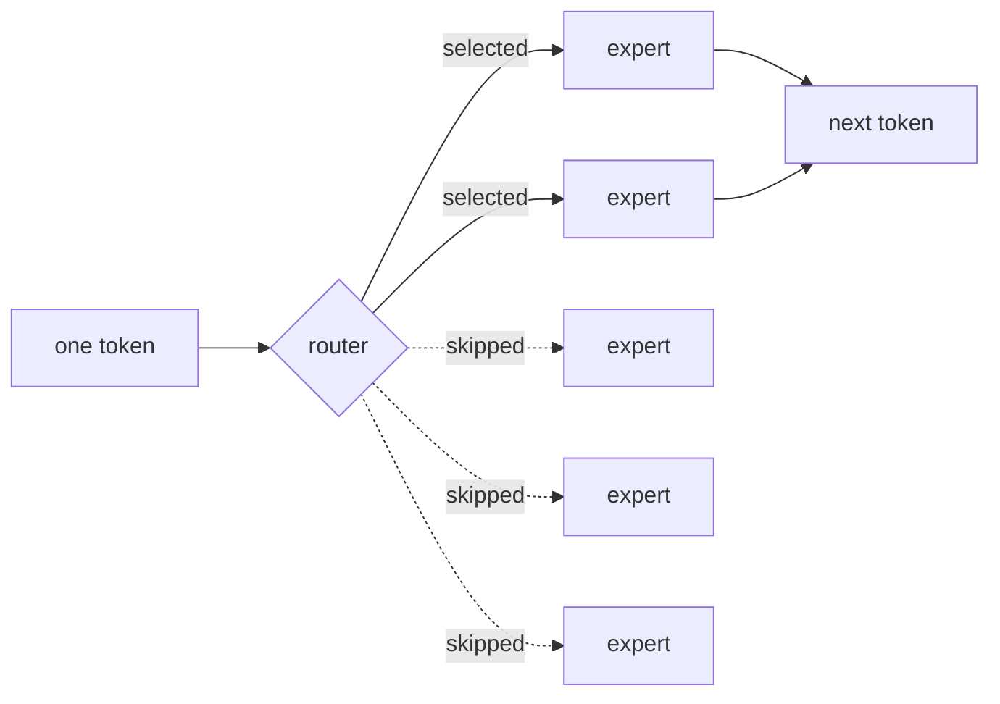
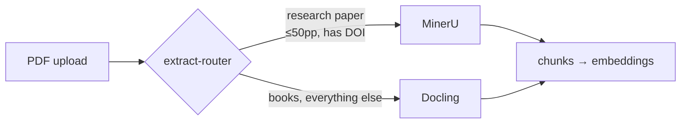

I wanted to know what actually happens when you type into a chat box.

Not the metaphor — the machine. Which bytes move, what's slow, why a model that
fits on a hard drive somehow can't run on the computer it's sitting on. The only
way I know to learn that is to build the thing badly a few times, so I bought a
small box and started taking it apart.

There's now a 122B-parameter model under my desk answering questions about the
books I'm reading, and nothing I ask it leaves the house. Here's how it got
there, including the parts that are still broken.

I called it **Outis Mneme** — "nobody's memory." Odysseus tells the Cyclops his
name is Nobody, and escapes because of it. On this machine, what you read, ask,
and think about is equally unattributable. That felt like the right name for a
box whose whole point is that it doesn't phone anyone.

The hardware is an [ASUS Ascent GX10](https://www.amazon.ca/dp/B0GSZQTSJZ):
NVIDIA GB10, 128GB of unified LPDDR5x. Remember that word *unified* — CPU and
GPU share one pool of memory. It turns out to be the most important fact about
the whole machine.

## Fork one: don't use Ollama

Everyone starts with Ollama. I nearly did, then read
[Stop Using Ollama](https://sleepingrobots.com/dreams/stop-using-ollama/), which
lays out how Ollama wrapped Georgi Gerganov's llama.cpp, spent a year not
mentioning it in the README, and later forked to a custom backend that
reintroduced bugs llama.cpp had already fixed. The benchmarks in there aren't
flattering either.

So I went straight to [llama.cpp](https://github.com/ggml-org/llama.cpp). It
also happened to suit what I was actually there for: llama.cpp makes you say
what you want. Every flag is a decision you have to understand first. That's
friction if you want a chatbot by dinnertime, and exactly right if you're trying
to learn the machine.

## Fork two: a model good enough to show me what wasn't

I started on **Qwen3.6-27B at Q8_0**, after reading
[Qwen 3.6 is awesome](https://quesma.com/blog/qwen-36-is-awesome/) — the author
calls it the first local model that makes sense as a general intelligence, and
for chat and summarizing, they're right. It was genuinely good.

Then I started asking it to reason. Work through a problem, hold several
constraints at once, notice when its own earlier step was wrong. A 27B doesn't
fail loudly at that. It fails *confidently*, which is worse, because you have to
already know the answer to catch it.

So I went looking for something bigger, and immediately hit the obvious wall: a
122B model is about 90GB of weights. How could that possibly run on a desktop?

## The one number that explains everything

This is the thing I actually came here to learn, so let me take it slowly.

Generating one token means reading the model's weights out of memory. Not doing
something clever with them — *reading* them. So the ceiling on speed isn't how
fast the GPU multiplies, it's how fast memory can hand bytes over:

```
tokens/sec  ≈  memory bandwidth ÷ bytes read per token
```

The GX10 has about 276 GB/s of memory bandwidth. (ASUS doesn't publish that
figure on their own spec page, oddly — it comes from
[ServeTheHome's coverage](https://www.servethehome.com/this-is-the-asus-ascent-gx10-a-nvidia-gb10-mini-pc-with-128gb-of-memory-and-200gbe/).)

A dense 122B model reads all ~90GB every single token. Do the division:

```
276 GB/s ÷ 90.4 GB  ≈  3 tokens/sec
```

Three tokens a second is a machine you stop opening. And that's the theoretical
figure, before reality takes its cut.

The way out is a **Mixture-of-Experts** model. The one I run is
Qwen3.5-**122B-A10B**, and that `A10B` is the whole trick: 122B parameters in
total, but only ~10B *active* per token. Each token gets routed through a small
subset of expert layers instead of all of them. The full model still has to fit
in memory — but only the active slice gets read.



So it reads about 7.25GB per token instead of 90. Same division:

```
276 GB/s ÷ 7.25 GB  ≈  38 tokens/sec
```

That's the difference between a toy and a tool. Which means the model choice was
never really about quality — it was about which model's *shape* fits the memory
bus.

## Does the arithmetic survive the machine?

I'd been repeating that equation to myself for months without once checking it
against the box. So I finally did: six runs, distinct prompts so nothing came
from cache, thinking mode off so I was timing generation rather than
variable-length reasoning.

```
generation  n=6  mean 26.97  stdev 0.02  min 26.93  max 27.00 tok/s
```

Predicted 38, measured **26.97** — about 71% of theoretical. That's a
thoroughly boring number and I was delighted by it: no real memory subsystem
hits its spec sheet, and 70-ish percent is what "nothing is wrong" looks like.
The back-of-envelope predicted my machine.

The other tell is the standard deviation. **0.02 tok/s across six runs.** I have
never measured anything that stable in my life. Nothing is contending, nothing
is scheduling, nothing is waiting on anything else — the workload is memory
bandwidth and essentially nothing else.

(Versions, because this kind of claim rots fast: llama.cpp build
`b10326-3653e6d6d`, Q5_K_M, 256K context, `--parallel 1`.)

## One number I got badly wrong

My first attempt at measuring prompt processing gave 73 tok/s and I nearly wrote
it down as fact. It's off by more than a factor of ten — the real figure is
800-plus.

The mistake is worth keeping. I measured on 20-token prompts, where the fixed
cost of setting up a request completely swamps the actual work, so I was
carefully timing overhead. The server's own logs, grinding through a
21,846-token prompt, told the truth at ~620 tok/s sustained.

The reason those numbers differ so wildly is the useful part: prompt processing
is compute-bound and batches beautifully — you can feed the GPU thousands of
tokens at once. Generation is bandwidth-bound and can't batch at all, because
each token depends on the one before it. Two completely different regimes living
in the same server, and a tiny prompt can't see either of them.

## What the context window actually costs

That error made me suspicious of another claim I'd written in my own README with
no evidence behind it: that quantizing the KV cache is "what makes a 256K
context fit."

The KV cache is the model's working memory of the conversation. At depth,
generating each new token means re-reading all of it — so it's a second term in
that same bandwidth equation. I measured generation speed at four context
depths:

| Context tokens | Generation | vs empty |
|---|---|---|
| 22 | 27.68 tok/s | — |
| 4,025 | 27.09 tok/s | −2.1% |
| 15,915 | 25.44 tok/s | −8.1% |
| 31,929 | 23.30 tok/s | −15.8% |

Plot seconds-per-token against depth and it's a straight line — R² of 0.999. The
slope says every token of context costs about **41.8 KB** of extra reading, on
every token you generate. Extrapolated to a full 256K context:

- **11.2 GB** for the cache, quantized to q8_0
- **22.4 GB** for the same cache at fp16

On a 128GB box already holding 90GB of weights, that 11GB gap is exactly the
difference between the context fitting and not fitting. The claim was right — it
just hadn't earned itself until there was a number under it.

## What all of this was actually for

I didn't build this to benchmark it. I have a large collection of ebooks, and I
wanted to ask questions across them and get citations I could check — to learn
faster from things I'm already reading, and to be able to verify the machine's
work rather than trust it.

[Open WebUI](https://github.com/open-webui/open-webui) fit almost perfectly:
chat, document knowledge bases, tool calling, all pointed at an
OpenAI-compatible endpoint, which llama.cpp already speaks.

Then the interesting failures started.

**The default embedder was wrong for books.** Open WebUI ships with
`all-MiniLM-L6-v2`, which is fine for chat-sized snippets and hopeless for
typeset pages — its context window chops a page into fragments mid-thought. I
swapped it for **nomic-embed-text-v1.5** at Q8_0, running as its own llama.cpp
process with an 8192-token window, so a long page survives as a single chunk.

It runs as a separate service deliberately. Embedding happens constantly — every
upload, every query — while generations are long and serial. Share one process
and your embedding jobs queue up behind somebody's 2,000-token answer.

**Then PDF extraction ate weeks.** Open WebUI's built-in extractor is pypdf,
which inserts spurious spaces into typeset books: "an e xample", "the ne xt
step." I assumed that was cosmetic. It isn't — `e xample` embeds as a completely
different vector than `example`, so every mangled word quietly poisons
retrieval. The text looked *almost* fine, which is why it took me so long to
suspect it.

I went through Tika, then Docling, then MinerU. Open WebUI only lets you
configure **one** extractor, so I ended up writing a small router to take that
slot and dispatch per document:



The payoff was measurable. One collection went from 68,193 chunks under pypdf to
47,296 under a real extractor — **28% of it had been garbage**, spurious spaces
inflating the character count. Fewer, cleaner chunks means less storage and less
junk competing for the handful of retrieval slots that actually reach the model.

## And it still doesn't work

Here's the honest ending. After three extractors, a custom router and a better
embedding model, **the citations still aren't good enough.**

The model reliably finds the right book. What it can't tell me is *where*. The
citation resolves to a chunk, not to a page or section I can turn to and check.
That makes it decorative — it looks verifiable and isn't, which is arguably
worse than no citation at all, because it invites exactly the trust it hasn't
earned. The entire point was checkable sources, and that's the part still
missing.

My current suspicion is that page anchors have to survive extraction *and* be
carried through chunking as metadata, and that none of the three extractors
preserve them in a form Open WebUI holds onto.

But I've parked it. Not solved — parked, deliberately. I could keep grinding on
extraction, and the honest assessment is that the next increment of effort there
buys me less than almost anything else I could do with the same hours. The
retrieval works well enough to point me at the right book, and I can find the
page myself. Knowing when a problem is genuinely blocking versus merely
unfinished is a skill I'm still bad at, and this was me trying to practise it.
It'll be there when it's worth doing.

There's a second loose thread I only noticed while writing this up. The 122B
GGUF ships multi-token-prediction weights, and llama.cpp is discarding them at
startup:

```
W model has unused tensor blk.48.nextn.eh_proj.weight (size = 20054016 bytes) -- ignoring
```

`nextn` is MTP — the same feature the Qwen 3.6 post measured at a **78%**
speedup on their hardware. So there may be a significant amount of performance
sitting unused inside a file I've been running for months. I don't yet know
whether this build can enable it for this architecture. If you do, I'd like to
hear it.

## Out of room, which is the good news

The thing I keep coming back to is that I've nearly filled the box. Peak memory
sits around 120GB of 128, and the GPU tops out near 96%. Right now, idle, the
host reports 107GB in use with 14 free.

Which is the same arithmetic from the top of this post, arriving from the other
direction. 90GB of weights, plus ~11GB of KV cache at full context, is 101GB
before the embedding model, the extractors and the UI have asked for anything.
The equation predicted how fast this machine would be, and it predicted where it
would run out. That's the part I didn't expect when I started — that one number
would turn out to describe *both* ceilings.

(A small aside I enjoyed: `nvidia-smi` reports `[N/A]` for GPU memory on this
box. With unified memory there is no separate GPU pool to report. The tool has
nothing to tell you because the question doesn't apply.)

So there's a long way to go, and that's the fun part. Two things I'm heading for
next:

**[Qwen3.8-27B](https://huggingface.co/Qwen/Qwen3.8-27B)**, which landed under
Apache 2.0 in mid-August — a dense 27B with native vision and a 262K context.
And here the equation makes a prediction I find genuinely funny. Dense means it
reads *all* its weights every token, so on this hardware:

| Model | Bytes read/token | Speed |
|---|---|---|
| Qwen3.8-27B dense, Q5_K_M | 19.6 GB | ~10 tok/s (predicted) |
| Qwen3.5-122B-A10B MoE, Q5_K_M | 7.25 GB | **26.97 tok/s (measured)** |

The 122B model should be roughly **2.7× faster than the 27B one**. A model with
four and a half times the parameters, running nearly three times quicker, on the
same box. That is the whole thesis of this post compressed into one comparison:
on bandwidth-limited hardware, parameter count tells you almost nothing about
speed — *active* parameter count tells you everything. I'll run it and find out
whether I'm right.

**[DeepSeek Harness](https://github.com/deepseek-ai/deepseek-harness)**, an
agent framework built entirely around plugins — "everything is a plugin." It's
in developer preview, so I expect sharp edges, but the architecture is the right
shape for where I actually want to end up.

**A Prometheus and Grafana stack**, so I can stop doing this by hand. Every
number in this post came from me curling an endpoint, grepping a log, or fitting
a line in a throwaway script. That's fine for answering one question once. It's
useless for the thing I actually want, which is noticing that generation got
slower last Tuesday and knowing why. Tokens per second against context depth,
KV cache occupancy, queue time, memory headroom — the same quantities I've been
measuring, but continuously and while I'm not looking.

The starting point turns out to be one flag. llama.cpp already has the endpoint;
it's just switched off:

```
$ curl -o /dev/null -w '%{http_code}\n' http://localhost:8080/metrics
501
```

A 501 rather than a 404 is the tell — the route exists, the server is telling me
it isn't implemented *as configured*. Adding `--metrics` turns it on. Tuning
inference by intuition is what I've been doing for months, and I'd like to
graduate to tuning it by evidence.

Because the goal was never a chatbot, and it was never really a benchmark
either. I want maximum automation of my own workloads, run on hardware I
control. And more than that: I read constantly, and
I want this thing to make me learn *faster* — to be the machine I argue with
about a book at midnight, that remembers what I read last month, and whose
answers I can check. It isn't that yet. The citations still don't land, half the
box's performance may be sitting in tensors llama.cpp is ignoring, and I've
nearly run out of memory to think with.

Which means there's plenty left to take apart. Good.

The whole stack — compose file, extraction router, docs — is at
[ankurtrapasiya/outis-mneme](https://github.com/ankurtrapasiya/outis-mneme). I
also ended up writing a custom Open WebUI theme along the way, which is its own
story for another post.

If you're building something similar: spend ten minutes with that first equation
and your own hardware's bandwidth before you pick a model. It told me more about
what this machine could do than every benchmark chart I read put together.

**References**

- [Stop Using Ollama](https://sleepingrobots.com/dreams/stop-using-ollama/) — why I went straight to llama.cpp
- [Qwen 3.6 is awesome](https://quesma.com/blog/qwen-36-is-awesome/) — picked my first model, and the source of the MTP numbers
- [llama.cpp](https://github.com/ggml-org/llama.cpp) — the engine all of this runs on
- [Open WebUI](https://github.com/open-webui/open-webui) — chat UI and knowledge bases
- [ServeTheHome on the ASUS Ascent GX10](https://www.servethehome.com/this-is-the-asus-ascent-gx10-a-nvidia-gb10-mini-pc-with-128gb-of-memory-and-200gbe/) — where the 276 GB/s figure comes from
- [Qwen3.8-27B](https://huggingface.co/Qwen/Qwen3.8-27B) — next on the list, and a test of the prediction above
- [DeepSeek Harness](https://github.com/deepseek-ai/deepseek-harness) — plugin-based agent framework I want to build on
