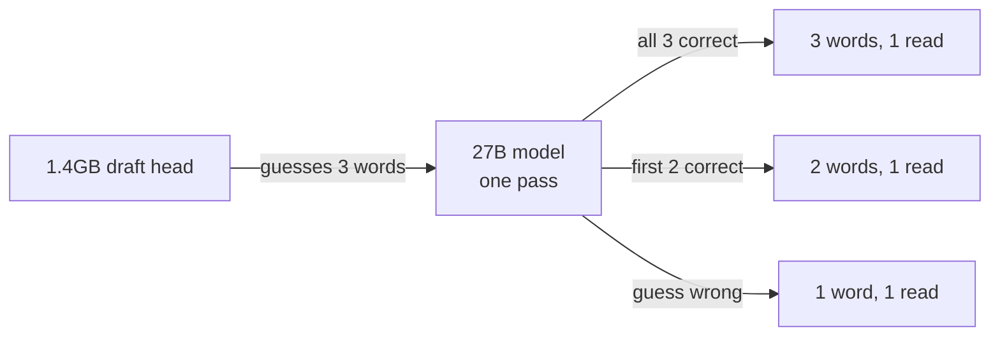

Four days ago I published [a post](/posts/2026-08-16-building-my-own-ai/) whose
whole argument rested on one division:

```
words per second  =  bytes memory can move in a second
                     ────────────────────────────────
                       bytes one word costs to read
```

The conclusion I drew from it was that on a memory-bound box, Mixture-of-Experts
isn't a nice-to-have. A dense model reads all of itself for every word; an MoE
reads a tenth of itself. On my machine that's the difference between three words
a second and twenty-seven. I measured it, it held, and I was pleased with
myself.

Then [Qwen3.8-27B](https://huggingface.co/Qwen/Qwen3.8-27B) came out. Dense. 27B
parameters, all of them read for every word.

By my own equation this is a downgrade. Twenty and three-quarter gigabytes read
per word instead of seven, so about a third of the speed. I nearly didn't
bother.

I'm glad I bothered, because the equation is missing a term, and I'd been
staring straight past it for months.

## First, the equation was right

I ran it before I got clever, so I'd have something to be wrong against. Six
prompts, six different topics so nothing comes back from a cache, decode only:

```
Qwen3.8-27B, no draft head
  code   n=6  mean 10.60  stdev 0.01  tok/s
  prose  n=6  mean 10.61  stdev 0.01  tok/s
```

Ten and a half words a second, against the 122B's twenty-seven. Exactly the
downgrade the division predicted — 10.6 against the 10 I'd written down.

Except the prediction was luckier than it looks, and I'd rather say so than let
you find it. I'd used 19.6 GB for the size of this model; the file on disk is
20.75. And I'd assumed it would hit the same ~70% of rated bandwidth my MoE
does; it manages 80%. Two errors pulling in opposite directions, cancelling to
within half a word a second. The shape of the answer was right. The precision
was a gift.

Except look at the two rows. Code and prose come out at the same number, to
within a hundredth. And the stdev is 0.01 — six runs, six different prompts,
essentially one answer. This is a machine doing the identical amount of work no
matter what you ask it. That's what "memory bandwidth bound" actually looks like
when you meet it in person: the content is irrelevant, because the bytes are the
same bytes every time.

Worth one more division. Twenty and three-quarter gigabytes per word, ten point
six words a second, is about 220 GB/s of real throughput — 80% of the 276 the
box is rated for. My MoE gets 71%. I'd expect the dense model to do better here:
it reads one contiguous block of weights, where the MoE has to gather scattered
experts. That's my read of why, not something I've instrumented, so take it as a
hypothesis.

## The term I was missing

The division says *bytes per word*. It quietly assumes that one pass through the
weights produces one word. That assumption is so obvious that I never wrote it
down, and never thought to question it.

Qwen3.8 ships a second, much smaller model alongside the main one — a 1.4GB
**MTP** head, for
[multi-token prediction](https://arxiv.org/abs/2404.19737), trained together
with the big one. llama.cpp will run it as a speculative decoder, and the trick
is this: the small head guesses the next three words, cheaply. The big model
then checks all three *in a single pass through its weights* — because checking
three candidate words costs it about the same as generating one. Every guess
that turns out right is a word you got without paying for another read.

The denominator stops being bytes per word. It becomes bytes per *accepted*
word.



Same six prompts, same box, one flag added:

```
Qwen3.8-27B, with draft head
  code   n=6  mean 28.86  stdev 1.68  tok/s
  prose  n=6  mean 21.79  stdev 1.92  tok/s
```

Code goes 2.7x. Prose goes 2.0x.

## The variance is the interesting part

Look at what happened to the stdev. It went from 0.01 to about 1.7, and the two
content types stopped agreeing with each other.

Without the draft head, this machine was doing the same work every time — same
bytes, same speed, boring and beautiful. With it, the machine is *gambling* on
every step, and how often the gamble pays depends entirely on how predictable
the text is. Code is enormously predictable. A small model that has seen a
million Python files can call `return`, `self.`, `):`  and the closing bracket
correctly most of the time, so most of the guesses land. Prose is less
predictable — there are more reasonable next words in an English sentence than
in a function body — so more guesses get thrown away and you pay for the read
anyway.

That's why the number moves around now. The speed of my machine has started
depending on what I ask it, which it never did before.

I didn't have to infer any of that, as it turns out. llama.cpp prints the
acceptance rate for every request, and I'd been ignoring the line for hours:

```
code   acceptance mean 0.784  stdev 0.073   mean run 3.35 words
prose  acceptance mean 0.514  stdev 0.074   mean run 2.54 words
```

Seventy-eight percent of guesses land on code; fifty-one percent on prose. Out
of every three-word guess, code keeps about 3.3 words and prose keeps about 2.5.
That ratio is the speed difference — 28.86 against 21.79 — and it isn't a
mystery about the model, it's just how predictable the text is.

## So was it worth it

Against the 122B it replaced, on the same box:

| | Qwen3.5-122B-A10B | Qwen3.8-27B + draft head |
|---|---|---|
| code | 26.97 tok/s | 28.86 tok/s |
| prose | 26.97 tok/s | 21.79 tok/s |
| memory used | ~99 GB | ~43 GB |
| reads images | no | yes |

Faster on code, meaningfully slower on prose, roughly a wash overall. If that
were the whole story I'd have left the 122B alone.

The reason I switched is the third row. Fifty-six gigabytes came back. On this
box the chat model was holding so much of the memory that the two document
extractors were fighting it for room — I'd written a comment in my own compose
file complaining about exactly that. Now they aren't. And the fourth row was
free: Qwen3.8 reads images natively, so pointing llama.cpp at the vision
projector means the chat model can look at a page directly instead of routing it
through a PDF pipeline.

Which raises a question I haven't answered: if the chat model can read the page
itself, what is my document extraction stack still for? I suspect the answer is
"layout, tables, and forty-page PDFs," and that the model is better on a single
screenshot. I haven't measured it. That's the next post, probably.

## The part that would have cost me

The draft head is one flag. Leave it out and you have a model 2.5x slower than
the one you removed, for no benefit at all — and it will look, from the outside,
exactly like a working setup. It starts, it answers, it's just quietly bad.

That flag now lives in my compose file with a comment explaining why it isn't
optional, because in six months I won't remember. While I was at it I pinned the
llama.cpp image by digest instead of the rolling tag, having discovered mid-way
through this that `--draft-max` had been renamed to `--spec-draft-n-max`
somewhere between the build I was running and the current one. An unpinned image
plus a renamed flag is a stack that breaks on a Tuesday for no reason you can
see.

## Still open

- I don't know whether Q6_K or Q8_0 is visibly better on my actual work. There's
  room for either now, which there wasn't before. Untested.
- The vision-versus-extractor question above.

The thing I'll actually take from this: I had a model of my machine that was
correct, that I'd measured, and that I trusted — and it was still hiding an
assumption I couldn't see because I'd never had a reason to look at it. The
equation didn't fail. It answered exactly the question I asked it, and I hadn't
noticed I was asking a narrower question than I thought.

If you're running a local model and haven't checked whether it ships a draft
head, go and check. It took one flag and it doubled my machine.

## References

- [Better & Faster Large Language Models via Multi-token Prediction](https://arxiv.org/abs/2404.19737) — Gloeckle et al., the MTP paper
- [Qwen3.8-27B model card](https://huggingface.co/Qwen/Qwen3.8-27B)
- [Qwen3.5-122B-A10B model card](https://huggingface.co/Qwen/Qwen3.5-122B-A10B) — the model this replaced
- [llama.cpp](https://github.com/ggml-org/llama.cpp)

Versions, because this kind of claim rots fast: llama.cpp build `10524-9ee9fc04c`,
Qwen3.8-27B at Q5_K_M with the Q4_0 draft head, `--ctx-size 262144`,
`--parallel 1`, no quantized KV cache. NVIDIA GB10, 128GB unified. The 122B
figure is from my own earlier measurement on build `10326-3653e6d6d`.
